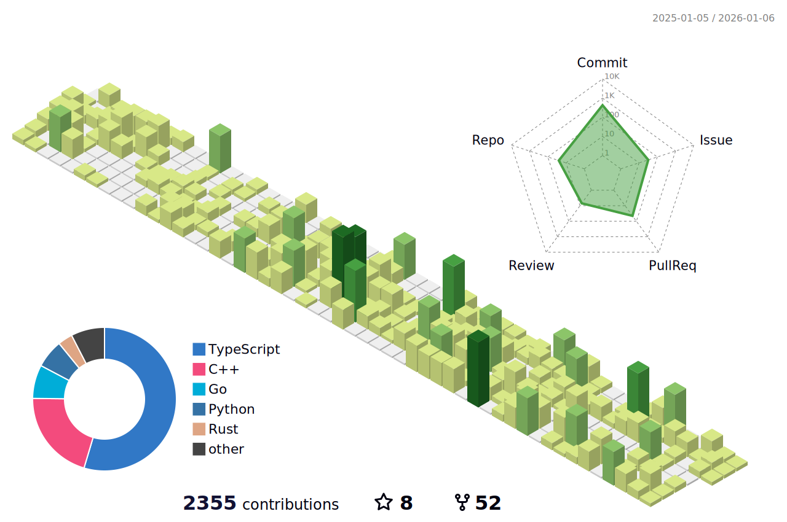

<!-- 

 -->

---

<h3 align="center">📊 Contributions</h3>

<picture>
  <source media="(prefers-color-scheme: dark)" srcset="./profile-3d-contrib/profile-night-view.svg" />
  <source media="(prefers-color-scheme: light)" srcset="./profile-3d-contrib/profile-green-animate.svg" />
  
</picture>

---

  
  

<!-- 

  

 -->

